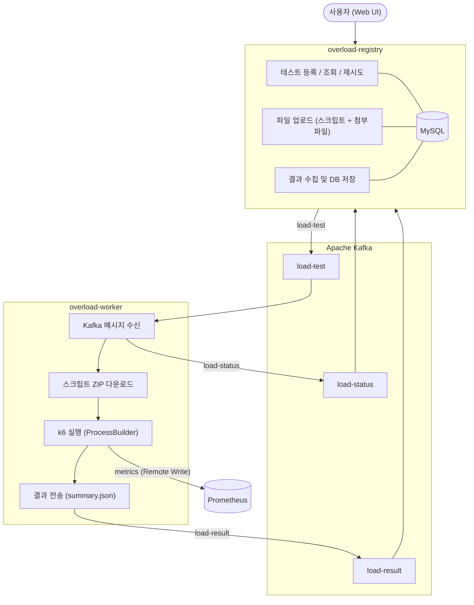

# Overload

k6 기반의 분산 부하 테스트 플랫폼. 테스트 등록·관리를 담당하는 **Registry**와 실제 부하를 실행하는 **Worker**로 구성된 멀티 모듈 프로젝트다.

---

## 아키텍처



### Kafka 토픽

| 토픽 | 방향 | 내용 |
|------|------|------|
| `load-test` | Registry → Worker | 테스트 실행 요청 (loadId, scriptFileName) |
| `load-status` | Worker → Registry | 테스트 상태 변경 (RUNNING / COMPLETED / FAILED) |
| `load-result` | Worker → Registry | k6 `summary.json` 결과 전송 |

---

## 모듈 구성

### overload-registry

테스트 등록·관리 서버. Spring MVC + Thymeleaf 기반 Web UI를 제공하며, JPA로 테스트 메타데이터를 MySQL에 저장한다.

**주요 기능**
- 부하 테스트 등록 (k6 스크립트 및 첨부파일 업로드)
- 테스트 목록 / 상세 조회
- 테스트 결과(summary.json) 수집 및 저장
- 실패 테스트 재시도
- 첨부파일 다운로드 (ZIP)

**패키지 구조**
```
com.errday.overloadregistry
├── config/       — P6Spy, Thymeleaf 설정
├── controller/   — MVC 컨트롤러(UI) + REST 컨트롤러
├── dto/          — 요청/응답 DTO
├── entity/       — Load, Script, AttacheFile, Summary, Client
├── enums/        — LoadStatus
├── repository/   — Spring Data JPA 레포지토리
└── service/      — 단위 서비스 + Orchestration 서비스
```

**Orchestration 패턴**

복수 서비스를 조합하는 유스케이스는 `*Orchestration` 클래스로 분리한다.

| 클래스 | 역할 |
|--------|------|
| `LoadRegisterOrchestration` | DB 저장 → 파일 저장 → Kafka 발행 |
| `LoadDetailOrchestration` | Load + Script + AttacheFile + Summary 조회 조합 |
| `SummarySaveOrchestration` | Load 조회 → Summary 저장 → 상태 업데이트 |
| `DownloadOrchestration` | 원본파일명 조회 + 리소스 반환, ZIP 생성 |
| `LoadRetryOrchestration` | 상태 초기화 → Kafka 재발행 |

---

### overload-worker

부하 테스트 실행 엔진. DB 의존성 없는 무상태(stateless) 서비스로, Kafka 메시지를 받아 k6를 실행한 뒤 결과를 다시 Kafka로 전송한다.

**실행 흐름**
1. `load-test` 토픽 메시지 수신
2. `RUNNING` 상태 전송
3. Registry에서 스크립트 ZIP 다운로드 후 압축 해제
4. `wrapper.js` 동적 생성 (htmlReport + handleSummary 포함)
5. `k6 run --out experimental-prometheus-rw wrapper.js` 실행
6. 실행 로그 → `{log-path}/load_{id}/load.log`
7. `summary.json` 읽어 `load-result` 토픽으로 전송
8. `COMPLETED` 상태 전송 / 예외 발생 시 `FAILED` 전송
9. 실행 디렉토리 정리

**패키지 구조**
```
com.errday.overloadworker
├── config/     — Kafka 설정
├── dto/        — KafkaConsumeDto, LoadStatusDto
├── service/
│   ├── LoadConsumerService   — Kafka 소비 + k6 실행 오케스트레이션
│   ├── DownloadService       — 파일 다운로드 및 압축 해제
│   └── KafkaProducerService  — 상태/결과 메시지 발행
└── LoadStatus.java           — REGISTERED / RUNNING / COMPLETED / FAILED
```

---

## 기술 스택

| 분류 | 기술 |
|------|------|
| Language | Java 25 |
| Framework | Spring Boot 4.0.3 |
| Persistence | Spring Data JPA, MySQL 8.0 |
| Messaging | Apache Kafka |
| UI | Spring MVC, Thymeleaf, Thymeleaf Layout Dialect |
| Load Testing | k6 |
| Metrics | Spring Actuator, Micrometer, Prometheus Remote Write |
| SQL Logging | P6Spy |
| Utilities | Lombok, Jackson, Apache Commons IO, Groovy |
| CI/CD | GitHub Actions |

---

## 사전 요구사항

- Java 25
- MySQL 8.0
- Apache Kafka
- k6 (Worker 실행 환경의 PATH에 설치)
- Prometheus (메트릭 수집 시)

---

## 설정

### overload-registry (`application.yaml`)

| 키 | 설명 |
|----|------|
| `spring.datasource.url` | MySQL JDBC URL |
| `spring.datasource.username` / `password` | DB 인증 정보 |
| `spring.kafka.bootstrap-servers` | Kafka 브로커 주소 (기본: `localhost:29092`) |
| `upload.path` | 스크립트/파일 업로드 저장 경로 |

### overload-worker (`application.yaml`)

| 키 | 설명 |
|----|------|
| `spring.kafka.bootstrap-servers` | Kafka 브로커 주소 |
| `script.download-path` | 다운로드된 스크립트 저장 경로 |
| `script.log-path` | k6 실행 로그 저장 경로 |
| `script.registry-url` | Registry 파일 다운로드 엔드포인트 (기본: `http://localhost:8080/download`) |
| `script.bundle-script` | htmlReport 번들 JS 경로 |
| `prometheus.endpoints` | Prometheus Remote Write URL |

---

## 빌드 및 실행

```bash
# overload-registry 실행
cd overload-registry
./gradlew bootRun

# overload-worker 실행
cd overload-worker
./gradlew bootRun
```

**테스트**

```bash
./gradlew test
```

---

## CI/CD

`main` 브랜치에 push 시 변경된 모듈에 해당하는 GitHub Actions 워크플로우가 자동 실행된다.

| 워크플로우 | 트리거 경로 | 작업 |
|-----------|------------|------|
| `registry-deploy.yml` | `overload-registry/**` | 테스트 → JAR 빌드 → SSH 배포 |
| `worker-deploy.yml` | `overload-worker/**` | 테스트 → JAR 빌드 → SSH 배포 |

Registry 배포 시 GitHub Actions 환경에 MySQL 서비스 컨테이너가 함께 실행된다.

배포에 필요한 서버 접속 정보는 GitHub Secrets으로 관리한다.

| Secret | 설명 |
|--------|------|
| `REGISTRY_SERVER_HOST` / `WORKER_SERVER_HOST` | 배포 서버 IP |
| `REGISTRY_SERVER_USER` / `WORKER_SERVER_USER` | SSH 사용자 |
| `REGISTRY_SERVER_SSH_KEY` / `WORKER_SERVER_SSH_KEY` | SSH 개인키 |
| `REGISTRY_DEPLOY_DIR` / `WORKER_DEPLOY_DIR` | JAR 배포 경로 |
| `REGISTRY_DEPLOY_SCRIPT` / `WORKER_DEPLOY_SCRIPT` | 서버 측 실행 스크립트 |

---

## 주의사항

- `application.yaml`에 DB 비밀번호가 평문으로 존재한다. 운영 환경에서는 환경변수나 외부 설정(Vault 등)으로 대체해야 한다.
- Worker의 Kafka 리스너는 `concurrency = "1"`로 한 번에 하나의 테스트만 순차 처리한다. 병렬 처리가 필요하다면 concurrency 값과 k6 프로세스 관리를 함께 검토해야 한다.
- k6 실행 시 `--insecure-skip-tls-verify` 플래그가 기본 적용된다. 운영 환경에서는 인증서 검증 여부를 재검토할 것.
- Thymeleaf 캐시는 개발 중 `false`로 설정되어 있다. 운영 배포 시 `true`로 변경할 것.
- P6Spy는 개발용이므로 운영 프로파일에서는 비활성화를 권장한다.